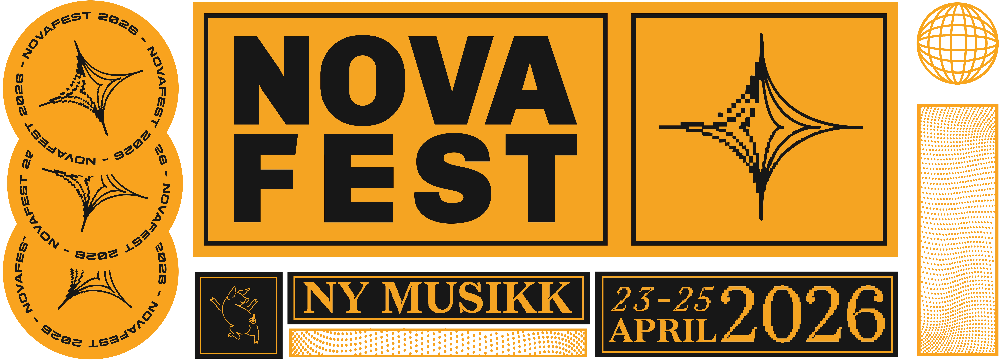

# Novafest 2026

Offisiell nettside for Novafest 2026 — Radio Novas årlige musikkfestival i Oslo, 23.–25. april.




**Stack:** Next.js (App Router), TypeScript, Tailwind CSS 4, React 19, Prisma 7 + PostgreSQL, Vercel

## Sider

- `/` — Forsiden med banner, artistkarusell og info
- `/artister` — Artistliste hentet fra databasen
- `/artister/[slug]` — Individuell artistside
- `/program` — Festivalprogram per dag
- `/om` — Om Radio Nova og festivalen
- `/frivillig` — Frivilligrekruttering

## Kom i gang

```bash
npm install
cp .env.local.example .env.local  # Legg inn POSTGRES_URL
npm run dev
```

### Database

```bash
cp .env.local .env
npx prisma migrate dev
npx prisma db seed
```

Åpne [http://localhost:3000](http://localhost:3000) i nettleseren.
